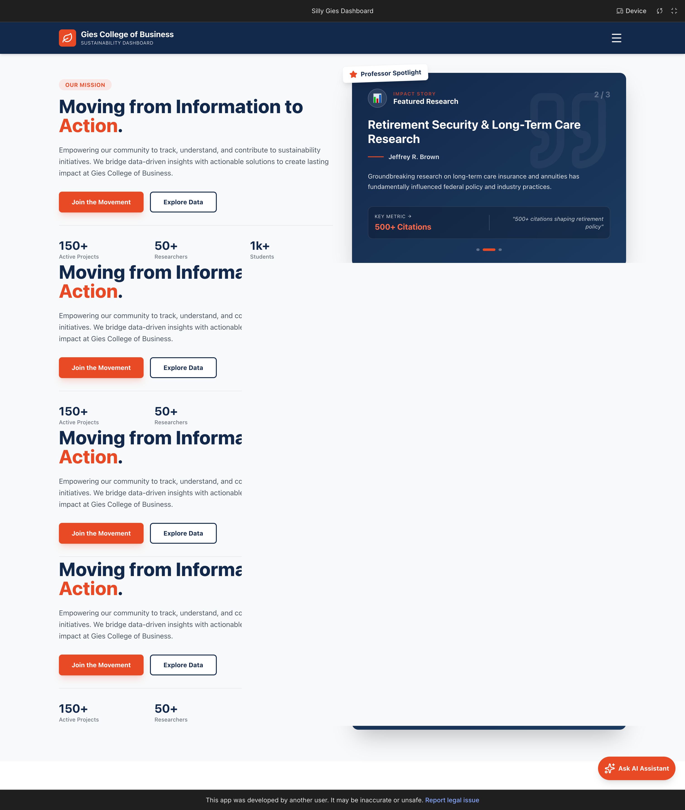
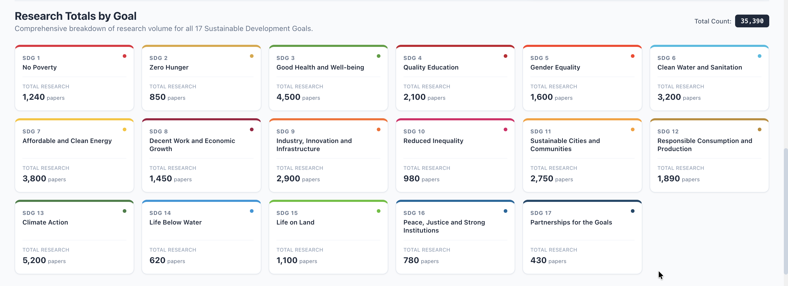
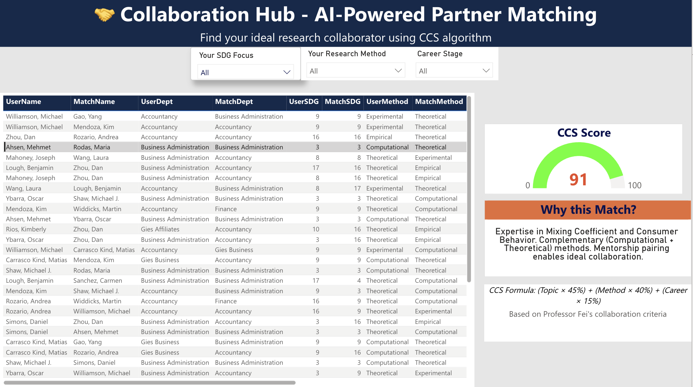
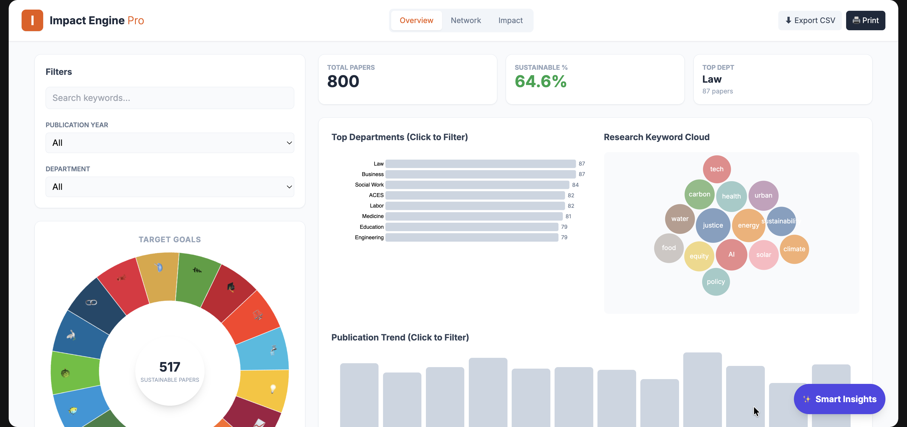

# The Illinois Sustainability Impact Engine

> An AI-powered platform for discovering sustainability research expertise and facilitating interdisciplinary collaboration across university departments.

[]()
[]()
[]()

---

## 📋 Table of Contents

- [Overview](#overview)
- [Problem Statement](#problem-statement)
- [Solution Architecture](#solution-architecture)
- [Platform Components](#platform-components)
- [Technical Implementation](#technical-implementation)
- [Data Pipeline](#data-pipeline)
- [Collaboration Compatibility Score (CCS)](#collaboration-compatibility-score-ccs)
- [Screenshots](#screenshots)
- [Project Documentation](#project-documentation)
- [Impact & Insights](#impact--insights)
- [Skills Demonstrated](#skills-demonstrated)
- [Future Work](#future-work)

---

## Overview

**The Illinois Sustainability Impact Engine** is a comprehensive decision-support platform designed to address the fragmentation of sustainability research across university departments. The solution enables researchers, faculty, and leadership to discover expertise, identify collaboration opportunities, and make data-driven decisions about sustainability initiatives aligned with the UN Sustainable Development Goals (SDGs).

### Core Value Proposition

- **🔍 Discovery**: Quickly identify sustainability research expertise across 17 UN SDGs
- **🤝 Collaboration**: AI-powered matching system connects researchers with complementary skills
- **📊 Insights**: Visualize research coverage, gaps, and trends to inform strategic decisions
- **🎯 Impact**: Support interdisciplinary research formation and strategic funding allocation

---

## Problem Statement

Universities generate extensive sustainability-related research, but this work is often fragmented across departments, disciplines, and individuals, leading to:

- ❌ Limited visibility into existing sustainability expertise
- ❌ Difficulty identifying collaborators with complementary skill sets
- ❌ Lack of structured insights into research coverage across UN SDGs
- ❌ Manual, time-intensive processes for finding research partners or gaps

**Result**: Opportunities for interdisciplinary collaboration and strategic sustainability initiatives are frequently missed.

---

## Solution Architecture

The platform consists of **five integrated components** that work together to provide a complete sustainability research ecosystem:

```
┌─────────────────────────────────────────────────────────┐
│         THE ILLINOIS SUSTAINABILITY IMPACT ENGINE       │
├─────────────────────────────────────────────────────────┤
│                                                          │
│  ┌──────────────┐  ┌──────────────┐  ┌──────────────┐ │
│  │Sustainability│  │   Research   │  │   Impact      │ │
│  │  Dashboard   │  │  Coverage   │  │   Engine      │ │
│  │              │  │  Analysis   │  │               │ │
│  │  • SDG Maps  │  │  • Gaps     │  │  • Metrics    │ │
│  │  • Trends    │  │  • Trends   │  │  • Outcomes   │ │
│  └──────┬───────┘  └──────┬──────┘  └──────┬───────┘ │
│         │                  │                 │          │
│         └──────────────────┼─────────────────┘          │
│                            │                            │
│                  ┌─────────▼─────────┐                  │
│                  │ Collaboration Hub │                  │
│                  │                   │                  │
│                  │  • CCS Algorithm  │                  │
│                  │  • Matching      │                  │
│                  │  • Recommendations                  │
│                  └─────────┬─────────┘                  │
│                            │                            │
│                  ┌─────────▼─────────┐                  │
│                  │  AI Prototype    │                  │
│                  │  (Google AI)     │                  │
│                  │                   │                  │
│                  │  • Interactive  │                  │
│                  │  • Guided Flow   │                  │
│                  │  • Explanations  │                  │
│                  └──────────────────┘                  │
│                                                          │
│  Data Pipeline: CSV → Python Scripts → Power BI        │
└─────────────────────────────────────────────────────────┘
```

---

## Platform Components

### 1. **Sustainability Dashboard** (Power BI)
**Purpose**: High-level visualization of institutional sustainability research

**Features**:
- Visualizes research activity across all 17 UN Sustainable Development Goals
- Interactive exploration of coverage, gaps, and trends
- Enables quick assessment of institutional strengths
- Supports strategic decision-making for leadership and donors

**Use Cases**:
- Leadership: "What are our institutional strengths in sustainability?"
- Donors: "Where should we invest funding?"
- Researchers: "What SDGs are most active at our institution?"

---

### 2. **Research Coverage Analysis** (Power BI)
**Purpose**: Detailed analysis of research distribution and gaps

**Features**:
- Identifies under-researched SDGs
- Tracks publication trends over time
- Analyzes departmental research distribution
- Highlights research opportunities

**Use Cases**:
- Students: "Which SDGs need more research?"
- Faculty: "What are emerging research areas?"
- Leadership: "Where are our research gaps?"

---

### 3. **Collaboration Hub** (Power BI)
**Purpose**: AI-powered researcher matching and collaboration recommendations

**Features**:
- Matches faculty and researchers based on compatibility
- Surfaces top collaboration recommendations using CCS algorithm
- Provides explainable recommendations with supporting reasoning
- Encourages interdisciplinary research team formation

**Use Cases**:
- Faculty: "Who should I collaborate with on SDG 13?"
- PhD Candidates: "Find me potential advisors in sustainability"
- Researchers: "Show me researchers with complementary methods"

**How It Works**:
1. User searches for collaborators (by SDG, method, or department)
2. System calculates Collaboration Compatibility Score (CCS) for all potential matches
3. Top matches are ranked and displayed with explanations
4. User can explore match details and initiate collaboration

---

### 4. **Impact Engine** (Power BI)
**Purpose**: Measure and visualize research impact and sustainability outcomes

**Features**:
- Tracks research impact metrics
- Visualizes sustainability outcomes
- Measures institutional impact across SDGs
- Supports impact reporting for stakeholders

**Use Cases**:
- Leadership: "What's our research impact on sustainability?"
- Donors: "Show me ROI on sustainability research funding"
- Researchers: "How can I measure my research impact?"

---

### 5. **AI Prototype** (Google AI Studio)
**Purpose**: Interactive AI assistant for guided sustainability decision-making

**Features**:
- Interactive AI assistant / workflow prototype
- Collects structured user inputs related to sustainability goals
- Evaluates trade-offs across environmental and operational dimensions
- Produces clear recommendations with supporting reasoning
- Supports scenario-based evaluation

**Use Cases**:
- Researchers: "Help me decide which sustainability project to pursue"
- Leadership: "Guide me through strategic sustainability planning"
- Students: "What sustainability research should I focus on?"

🔗 **Prototype Link**: [Try the AI Prototype](https://aistudio.google.com/apps/drive/1X32F5D6MjYPmdbODCHqlfB8VLEVzwbeE?showPreview=true&showAssistant=true)

> Note: If access is restricted, screenshots and workflow visuals are provided in the `/screenshots` folder.

---

### Component Integration

**User Journey Example**:

1. **Discovery Phase**: User opens **Sustainability Dashboard** → sees SDG 9 (Industry, Innovation) is well-researched
2. **Analysis Phase**: Checks **Research Coverage** → identifies SDG 13 (Climate Action) as a gap
3. **Collaboration Phase**: Uses **Collaboration Hub** → searches for collaborators working on SDG 13
4. **Matching Phase**: Gets matched recommendations → CCS scores explain why matches are good
5. **Impact Phase**: Uses **Impact Engine** → sees potential impact of forming this collaboration
6. **Decision Phase**: Uses **AI Prototype** → gets guided recommendations on next steps

---

## Technical Implementation

### Platform Stack
- **Visualization**: Power BI dashboards (4 interactive components)
- **Data Processing**: Python scripts for data transformation and aggregation
- **AI/ML**: Algorithm-based compatibility scoring + Google AI Studio prototype
- **Data Source**: University publication metadata (CSV format)

### Technology Components

1. **Data Processing Pipeline**
   - Aggregates publication data into researcher profiles
   - Infers research methods from keywords and abstracts
   - Calculates career stages from publication history
   - Extracts and ranks SDG associations

2. **Collaboration Compatibility Algorithm**
   - Multi-factor scoring system
   - Weighted component analysis
   - Explainable recommendation generation

3. **Interactive Dashboards**
   - SDG coverage visualization
   - Research trend analysis
   - Collaboration match interface
   - Impact metrics tracking

4. **AI Assistant**
   - Google AI Studio workflow
   - Structured decision support
   - Scenario evaluation

---

## Data Pipeline

The solution processes raw publication data through a multi-stage pipeline. The
demo data in this repo was generated using the logic below; the scripts are not
included in this public version.

```
Original CSV (filtered_publications.csv)
    ↓
[build_collab_hub_from_scratch.py]
    ↓
Researcher_Profiles_For_PowerBI.csv
    ↓
[generate_ccs_demo_data.py]
    ↓
data/CCS_Demo_Data.csv (for Power BI visualization)
```

### Data Transformations

1. **Researcher Profile Aggregation** (`build_collab_hub_from_scratch.py`)
   - Consolidates multiple publications per researcher
   - Identifies primary SDG focus (from top 1/2/3 SDG columns)
   - Infers research methods from keywords/abstracts
   - Calculates career stage from first publication year
   - Extracts top keywords by frequency

2. **Compatibility Score Generation** (`generate_ccs_demo_data.py`)
   - Creates simulated user searches with varied criteria
   - Matches researchers based on compatibility algorithm
   - Generates explainable recommendations
   - Calculates CCS scores for all matches

### Pipeline Scripts (not included)

The pipeline below reflects the logic used to generate the demo data. The
scripts are not included in this public repository.

For detailed data processing documentation, see [CCS_DEMO_DATA_EXPLANATION.md](docs/methodology/CCS_DEMO_DATA_EXPLANATION.md) and [SDG_MATCHING_EXPLANATION.md](docs/methodology/SDG_MATCHING_EXPLANATION.md).

---

## Collaboration Compatibility Score (CCS)

The CCS algorithm evaluates potential research collaborations using a weighted multi-factor model:

### Scoring Components

| Component | Weight | Range | Description |
|-----------|--------|-------|-------------|
| **Topic Match** | 45% | 70-95 | SDG alignment (exact match, related SDGs, or different clusters) |
| **Methodological Match** | 40% | 70-95 | Method complementarity (complementary methods score higher) |
| **Career Fit** | 15% | 70-92 | Career stage pairing (mentorship opportunities score higher) |

### Calculation Formula

```
CCS_Total = ROUND((Topic_Match × 0.45) + (Method_Match × 0.40) + (Career_Fit × 0.15))
```

### Scoring Logic

**Topic Match (Hierarchical Matching)**:
- **90-95**: Identical primary SDGs
- **85-89**: Primary SDG appears in other's SDG list
- **80-84**: Any SDG overlap between researchers
- **75-79**: Adjacent SDGs (e.g., 8 and 9)
- **72-76**: Same SDG category (Social, Economic, Environmental)
- **70-74**: Default (no match)

**Method Match**:
- **85-95**: Complementary methods (e.g., Theoretical + Empirical)
- **70-80**: Same or similar methods

**Career Fit**:
- **85-92**: Mentorship opportunities (Pre-Tenure + Post-Tenure/Senior)
- **75-82**: Peer collaboration (same stage, especially Post-Tenure)
- **70-80**: Other combinations

### Example Output

```
User: Dr. Smith (SDG 9, Computational, Post-Tenure)
Match: Dr. Jones (SDG 9, Empirical, Pre-Tenure)

Topic_Match: 93 (exact SDG match)
Method_Match: 91 (complementary methods)
Career_Fit: 87 (mentorship opportunity)
CCS_Total: 91

Explanation: "Expertise in Machine Learning and Data Analytics. 
Highly complementary methods (Computational + Empirical) create 
exceptional research synergy. Strong mentorship pairing: 
Post-Tenure and Pre-Tenure researchers."
```

For detailed scoring documentation, see [docs/04_scoring_and_metrics.md](docs/04_scoring_and_metrics.md) and [SDG_MATCHING_EXPLANATION.md](docs/methodology/SDG_MATCHING_EXPLANATION.md).

---

## Data & Methodology (Demo Transparency)

This repo includes **demo data** designed to illustrate how the collaboration scoring works.

**What's real**
- Researcher names and departments
- SDG labels aggregated from publication metadata
- Methods inferred from keywords/abstracts
- Career stage inferred from first publication year
- Top keywords for explanations

**What's simulated**
- Some user search inputs (SDG/method) are varied to show multiple scenarios
- All scores (Topic/Method/Career/CCS) are calculated by the algorithm
- Explanations are generated from keywords + scoring logic

**Important note:** The CCS score is **directional and explainable**, not a predictive model of collaboration success.

---

## Reproducibility (Pipeline)

Raw publication data → researcher profiles → CCS demo matches:

1. `build_collab_hub_from_scratch.py`  
   Input: publication CSV  
   Output: `Researcher_Profiles_For_PowerBI.csv`

2. `generate_ccs_demo_data.py`  
   Input: `Researcher_Profiles_For_PowerBI.csv`  
   Output: `data/CCS_Demo_Data.csv`

See `docs/methodology/CCS_DEMO_DATA_EXPLANATION.md` and
`docs/methodology/SDG_MATCHING_EXPLANATION.md` for the full logic used to
generate the demo data.

---

## Screenshots

### Sustainability Dashboard

*High-level visualization of research activity across all 17 UN SDGs*

### Research Coverage Analysis

*Detailed analysis of research distribution, gaps, and trends*

### Collaboration Hub

*AI-powered researcher matching with CCS scoring*

### Impact Engine

*Research impact metrics and sustainability outcomes visualization*

---

## Project Documentation

Comprehensive documentation is available in the `/docs` folder:

- 📄 [Problem Statement](docs/01_problem_statement.md) - Detailed problem analysis
- 👥 [Stakeholder Analysis](docs/02_stakeholder_analysis.md) - User personas and needs
- 🏗️ [Solution Architecture](docs/03_solution_architecture.md) - System design and components
- 📊 [Scoring Logic & Metrics](docs/04_scoring_and_metrics.md) - CCS algorithm details
- 💡 [Insights & Impact](docs/05_insights_and_impact.md) - Key findings and value proposition
- 🔮 [Limitations & Future Work](docs/06_limitations_and_future_work.md) - Roadmap and enhancements

### Additional Resources

- 📋 [CCS Demo Data Explanation](docs/methodology/CCS_DEMO_DATA_EXPLANATION.md) - Data processing pipeline documentation
- 🎯 [SDG Matching Explanation](docs/methodology/SDG_MATCHING_EXPLANATION.md) - Detailed SDG matching algorithm
- 🧾 [Data Sources](docs/methodology/DATA_SOURCES.md) - Fields used and derived
- 📚 [Data Dictionary](docs/methodology/DATA_DICTIONARY.md) - Column definitions for demo data
- 🧪 [Methodology Summary](docs/methodology/METHODOLOGY.md) - Pipeline, scoring, limitations

---

## Impact & Insights

### Key Findings

- ✅ Certain SDGs receive significantly more research attention than others
- ✅ Collaboration opportunities exist across departments that rarely interact
- ✅ Early-career researchers benefit from structured discovery tools
- ✅ Data-driven insights support strategic funding decisions

### Measurable Impact

- **Visibility**: Improves visibility of sustainability expertise across the institution
- **Efficiency**: Reduces friction in forming interdisciplinary research teams
- **Strategy**: Supports data-driven decision making for leadership and donors
- **Culture**: Moves from passive information access to proactive insight generation

For detailed impact analysis, see [docs/05_insights_and_impact.md](docs/05_insights_and_impact.md).

---

## Skills Demonstrated

### Technical Skills
- **Data Engineering**: ETL pipeline design and implementation
- **Data Analysis**: Statistical analysis and pattern recognition
- **Algorithm Design**: Multi-factor scoring system development
- **Data Visualization**: Power BI dashboard creation (4 integrated components)
- **Python Programming**: Data processing and transformation scripts
- **AI/ML Integration**: Google AI Studio prototype development

### Business & Analytical Skills
- **Problem Structuring**: Business analytics lens for complex problems
- **Stakeholder Analysis**: Multi-user persona design
- **Decision Modeling**: Quantitative scoring framework development
- **Sustainability Analytics**: UN SDG mapping and analysis
- **Strategic Thinking**: Institutional impact assessment

### Communication Skills
- **Technical Documentation**: Comprehensive project documentation
- **Visual Storytelling**: Dashboard design and data visualization
- **Case Presentation**: Competition presentation development
- **Stakeholder Communication**: User-focused solution design

---

## Future Work

### Current Limitations
- Prototype-level implementation
- Limited availability of standardized research metadata
- Qualitative reasoning over automated optimization

### Planned Enhancements

1. **Data Integration**
   - Integration with live publication and grant databases
   - Real-time data updates
   - Expanded data sources (conferences, patents, etc.)

2. **Advanced Analytics**
   - Advanced NLP for topic modeling
   - Predictive analytics for collaboration success
   - Network analysis for research communities

3. **Platform Features**
   - Dynamic KPI tracking over time
   - User profiles and preferences
   - Notification system for new matches
   - Integration between all 5 components

4. **Expansion**
   - Beyond sustainability to other research domains
   - Multi-institutional collaboration
   - Industry partnership matching

For detailed future work roadmap, see [docs/06_limitations_and_future_work.md](docs/06_limitations_and_future_work.md).

---

## Project Context

This project was developed as part of a **sustainability-focused case competition**, where the objective was to design a practical, AI-enabled solution that balances environmental impact with business feasibility.

### Competition Focus

Rather than building a heavy ML system, the focus was on:
- Problem framing and decision intelligence
- Stakeholder usability and adoption
- Translating sustainability goals into actionable insights
- Balancing technical sophistication with practical implementation

---

## Repository Structure

```
sustainability_case_competition/
├── README.md                          # This file
├── requirements.txt                   # Python dependencies
├── .gitignore                         # Git ignore rules
├── data/                              # Demo data for Power BI
│   └── CCS_Demo_Data.csv
├── docs/                              # Project documentation
│   ├── 01_problem_statement.md
│   ├── 02_stakeholder_analysis.md
│   ├── 03_solution_architecture.md
│   ├── 04_scoring_and_metrics.md
│   ├── 05_insights_and_impact.md
│   ├── 06_limitations_and_future_work.md
│   └── methodology/                   # Transparency and scoring details
│       ├── CCS_DEMO_DATA_EXPLANATION.md
│       ├── SDG_MATCHING_EXPLANATION.md
│       ├── DATA_SOURCES.md
│       ├── DATA_DICTIONARY.md
│       └── METHODOLOGY.md
├── scripts/                           # Data processing notes
│   └── README.md
├── screenshots/                       # Dashboard screenshots
│   ├── Sustainability.png
│   ├── research.png
│   ├── collabration_hub.png
│   └── Impact_engine_pro.png
└── presentation/                      # Competition presentation
    └── Case Comp.pdf
```

---

## Disclaimer

This project is an academic case competition submission.  
No proprietary or confidential data was used.  
All data processing and analysis was performed on publicly available or anonymized university publication metadata.

---

## Contact & Links

- 📧 For questions or collaboration opportunities, please reach out through GitHub
- 📊 Power BI report: https://app.powerbi.com/groups/me/reports/8c00bb12-b145-4b39-ac02-85b5aa41f628/c49807a08d6527738b11?experience=power-bi (requires access)
- 📄 Full presentation materials available in `/presentation` folder
- 🤖 AI Prototype: [Try the AI Prototype](https://aistudio.google.com/apps/drive/1X32F5D6MjYPmdbODCHqlfB8VLEVzwbeE?showPreview=true&showAssistant=true)

---

**Built with** ❤️ **for sustainable research collaboration**

*Last updated: 2025*
